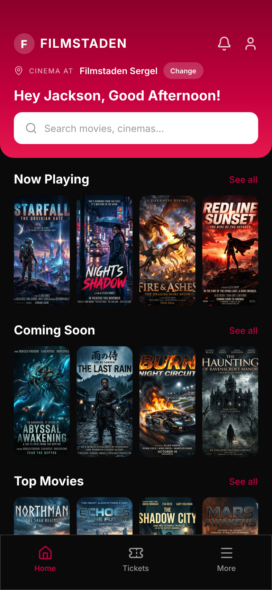
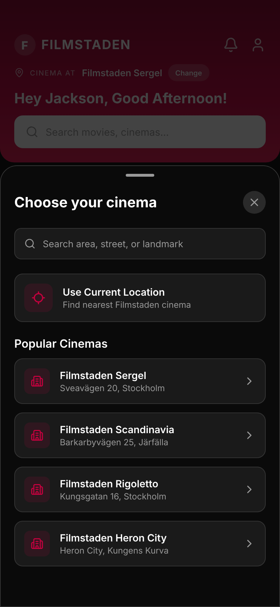
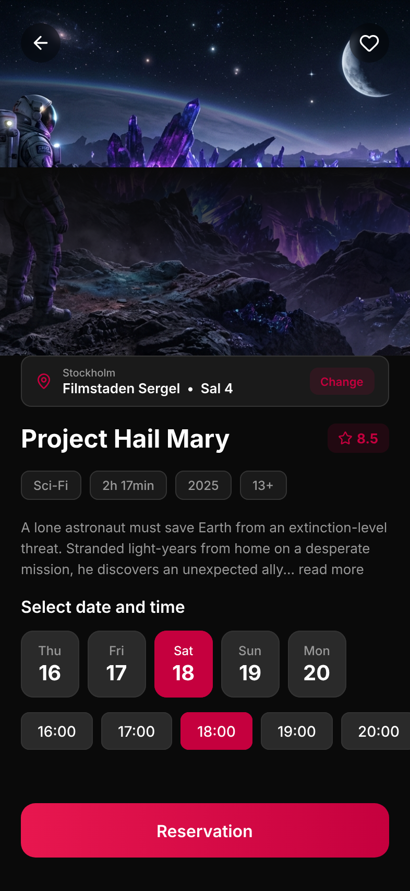
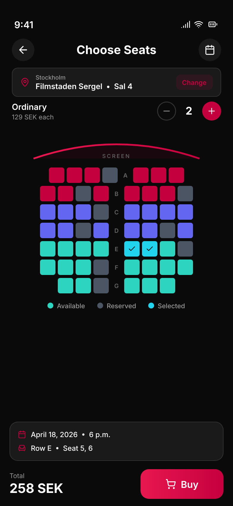
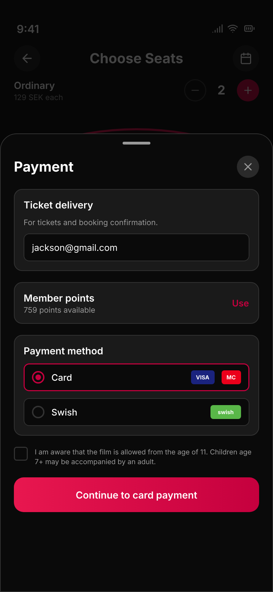
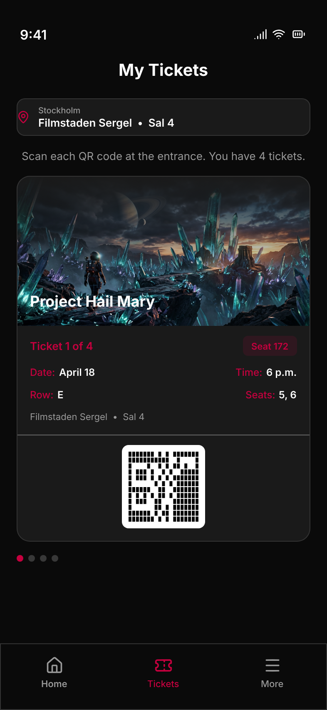
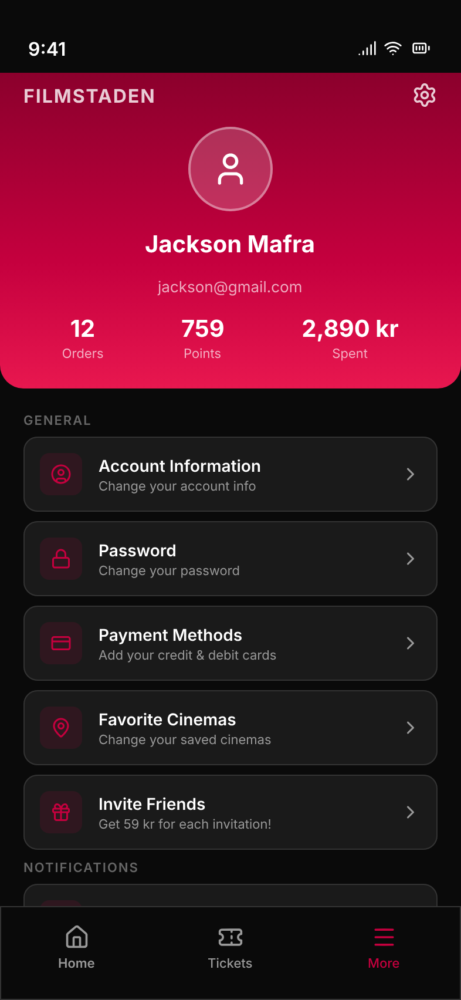
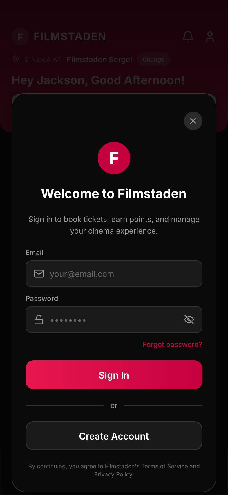

# Filmstaden — Showcase Demo

A non-affiliated, for-fun concept redesign of the Swedish cinema chain's mobile app, built with modern Android tooling. All content, logos, and brand references are used only as a visual reference for exploration; this is not an official Filmstaden product.

The goal was to practice recent Android stack pieces (Jetpack Navigation 3, shared-element transitions, Koin 4, edge-to-edge) while building something a little more opinionated than a counter app — a small, self-contained booking flow with realistic states.

## Screenshots

| Home | Cinema picker | Movie Detail | Seat Selection |
| :--: | :--: | :--: | :--: |
|  |  |  |  |

| Payment | My Tickets | More / Profile | Login |
| :--: | :--: | :--: | :--: |
|  |  |  |  |

## What's inside

- **Home** with reactive cinema selector (shared state across screens)
- **Movie Detail** with hero image, date/time chips — shared-element transition from poster to hero
- **Seat Selection** with tiered pricing, live-derived stepper (label and price-each reflect the currently selected tier, stepper blocked at limits)
- **Payment** bottom sheet with card / Swish options
- **My Tickets** with a `HorizontalPager` of QR-code tickets
- **More / Profile** with stats and animated theme toggle
- **Login** modal

## Tech

- **Kotlin 2.3**, **Compose BOM 2025.12** on **AGP 8.10**, targeting SDK 36
- **Navigation 3 (1.1.0)** with shared-element transitions via `SharedTransitionLayout` + `LocalNavAnimatedContentScope`
- **Koin 4** for DI (`single` repository + `CinemaSheetViewModel` shared across the nav graph)
- **StateFlow**-based state in VMs; cinema selection lives in the repository as the source of truth
- **Edge-to-edge** with transparent system bars; per-screen `navigationBarsPadding()` / hero imagery handles safe areas
- **MotionLayout-free** animations — springy press feedback, animated tab pill indicator, seat scale-in, etc.

## Architecture notes

- `FilmstadenRepository` exposes `selectedCinema: StateFlow<Cinema>`; `CinemaSheetViewModel` is registered as `single` and hosted once at `AppRoot`, so every screen opens the *same* bottom sheet through `cinemaSheetVm::open`. No event bus, no nav-graph-scoped VM gymnastics.
- `ui/SharedTransition.kt` provides a tiny `sharedElementModifier(key)` helper that combines the `SharedTransitionScope` from `SharedTransitionLayout` with `LocalNavAnimatedContentScope` from Navigation 3 — drop it on any composable to participate in the transition.
- Seat stepper is derived (`ticketCount = selectedSeats.size`) instead of stored, so the stepper and the seat map can never disagree.

## Run it

```bash
./gradlew :app:assembleDebug
./gradlew :app:installDebug
```

Requires JDK 17+ and a device/emulator on API 29+.

## Design source

The `design/filmstaden.pen` file is the source of truth for the mockups; screenshots above are exported from it.
